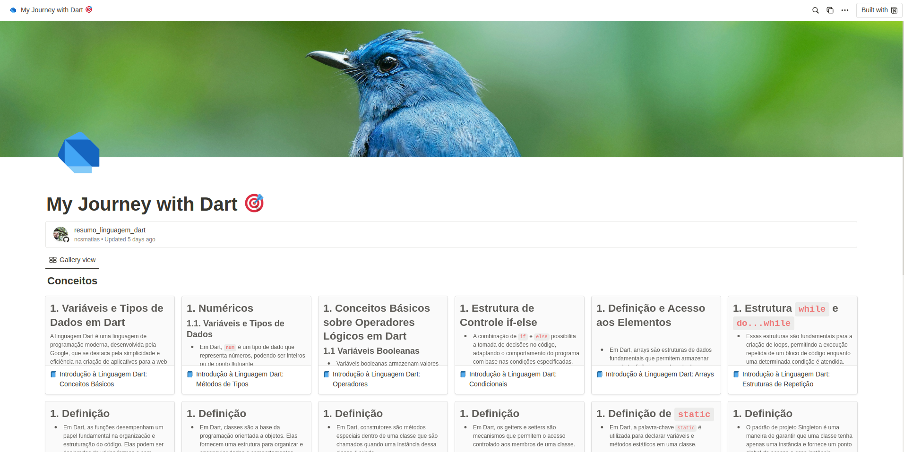

# My Journey with Dart 🎯

Este repositório serve como um resumo conciso da linguagem Dart que eu criei para mim assistindo ao curso [Dart lang do básico ao avançado + Api Rest!](https://www.udemy.com/course/dart-lang-basico-avancado-api-rest). O resumo aborda os principais métodos de tipos e suas funções, além de conceitos fundamentais de Orientação a Objetos em Dart. Embora possa parecer um pouco complexo para iniciantes, é uma ferramenta valiosa para consultas rápidas, especialmente para aqueles que já têm experiência em Dart ou em outras linguagens de programação similares.

Para uma compreensão mais aprofundada, todos os métodos estão detalhadamente descritos no meu Notion: [Introdução ao Dart](https://odd-apricot-372.notion.site/Dart-5ec53ad880244f569c1a2b43c8ddaca2?pvs=4).

Fique à vontade para entrar em contato em caso de dúvidas ou sugestões. Este recurso é destinado a facilitar o entendimento e aprimorar o conhecimento sobre Dart de forma rápida e eficiente.

## Atenção

- Ainda estou finalizando o conteúdo.
